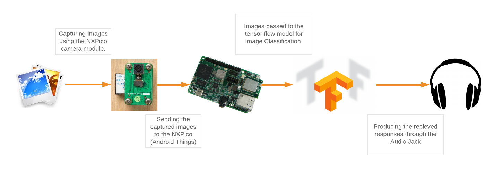
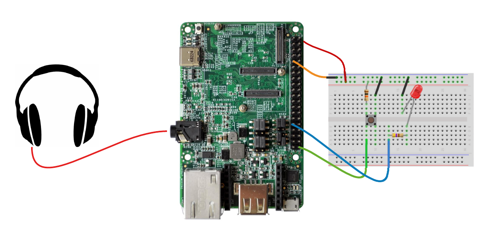
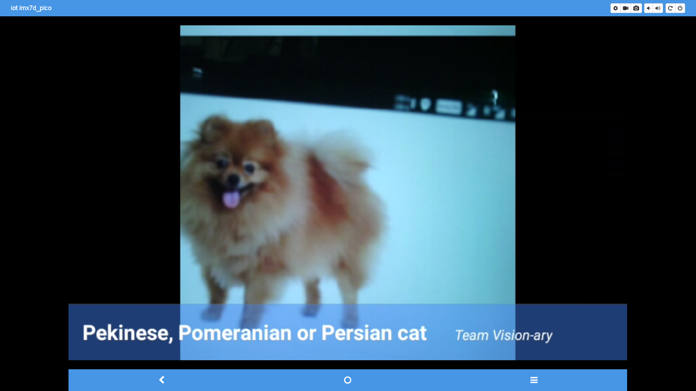

# Vision for Blind

## Introduction

Blind people have an immeasurable curiosity about the world around them and one of the major obstacle faced by them in their daily life is identifying what is present in front of them. Vision aims to become their sight.

Vision helps the blind people identify objects by producing output in the form of audio signals. The project's approach lies in developing a system based on NXPico MX7 which is capable of labeling objects with the help of TensorFlow libraries and converting the labeled text to speech using an API and producing output in the form of audio signals.

When a button is pushed or when the touchscreen is touched, the current image is captured from the
camera. The image is then converted and piped into a TensorFlow Lite classifier model that
identifies what is in the image. Up to three results with the highest confidence returned by the
classifier are shown on the screen, if there is an attached display. Also, the result is spoken out
loud using Text-To-Speech to the default audio output.




## Schematics




## Results as per custom trained model

We have trained for 15 custom categories, few are below, with their working samples.

| Bottle             |  Dog |
:-------------------------:|:-------------------------:
  |  


## How to train your ~~Dragon 🐉~~ Model?

First thought after cloning this is that how can I train my own custom model, so that I can extend categories and all.

We have added all tools which will be used [here](tools/).

Use them to follow the steps below.

### Install requirements

```sh
$ sudo pip install tensorflow
$ sudo pip install tensorboard
```

### Train a GraphDef

1. Load your images of one category with folder name as the object name.
2. `cd tools/` and copy the path to folder of images.
3. Generate **.pb** and **checkpoint** file using
    ```sh
    python retrain.py --image_dir <path-to-dataset>
    ```

After the training is complete you can also visualize training and see stats of training using

```sh
tensorboard --logdir /tmp/retrain_logs
```

where `/tmp/retrain_logs` is your log directory.


### Check you GraphDef file

```sh 
python label_image.py \
--graph=/tmp/output_graph.pb --labels=/tmp/output_labels.txt \
--input_layer=Placeholder \
--output_layer=final_result \
--image=<path-to-image-you-want-to-test>
```

### Freeze your GraphDef Model

In your training directory there will be three files with same name, In our case they are

```sh
-rw-r--r-- 1 vision 197609 87301292 Jul 11 04:21 _retrain_checkpoint.data-00000-of-00001
-rw-r--r-- 1 vision 197609    17086 Jul 11 04:21 _retrain_checkpoint.index
-rw-r--r-- 1 vision 197609  3990809 Jul 11 04:21 _retrain_checkpoint.meta
``` 

If the name is same, simply run

```sh
$ sudo python freeze.py
```

If name is different then open [freeze.py](tools/freeze.py) and place your file's name instead of `new_name`

```diff 
Line 4
- saver = tf.train.import_meta_graph('./_retrain_checkpoint.meta', clear_devices=True)
+ saver = tf.train.import_meta_graph('./new_name.meta', clear_devices=True)
```

```diff
Line 8
- saver.restore(sess, "./_retrain_checkpoint")
+ saver.restore(sess, "./new_name")

```


### Converting into a TFLite Model

First install TOCO using:

```sh
$ sudo pip install toco
```

Now, convert using:

```sh
IMAGE_SIZE=224
toco \
  --input_file=tf_files/retrained_graph.pb \
  --output_file=tf_files/optimized_graph.lite \
  --input_format=TENSORFLOW_GRAPHDEF \
  --output_format=TFLITE \
  --input_shape=1,${IMAGE_SIZE},${IMAGE_SIZE},3 \
  --input_array=input \
  --output_array=final_result \
  --inference_type=FLOAT \
  --input_data_type=FLOAT
```

### Finishing up

Place the generated `.tflite` and `labels.txt` file to assets folder of Android App.


## Demo

Will be uploaded soon

## Enable auto-launch behavior

This sample app is currently configured to launch only when deployed from your
development machine. To enable the main activity to launch automatically on boot,
add the following `intent-filter` to the app's manifest file:

```xml
<activity ...>

   <intent-filter>
       <action android:name="android.intent.action.MAIN"/>
       <category android:name="android.intent.category.HOME"/>
       <category android:name="android.intent.category.DEFAULT"/>
   </intent-filter>

</activity>
```

## License

This is Float32 extension of [Google's Sample Image Classifier for Android](https://github.com/androidthings/sample-tensorflow-imageclassifier)

## Contributors

<details>
	<summary>Team Vision</summary>
		<ul>
			<li><a href="https://github.com/aashutoshrathi">Aashutosh Rathi</a></li>
			<li><a href="https://github.com/anshumanv">Anshuman Verma</a></li>
		        <li><a href="https://github.com/prithaupadhyay">Pritha Upadhyay</a></li>
			<li><a href="https://github.com/VaaibhaviSingh">Vaaibhavi Singh</a></li>
			
			
		</ul>
</details>

## References

- [Model Retraining and Transfer Learning](https://www.tensorflow.org/tutorials/image_retraining)
- [Generate TFLite file](https://codelabs.developers.google.com/codelabs/tensorflow-for-poets-2-tflite/#0)
